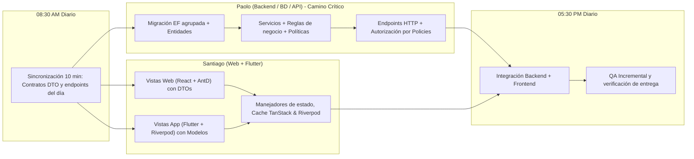
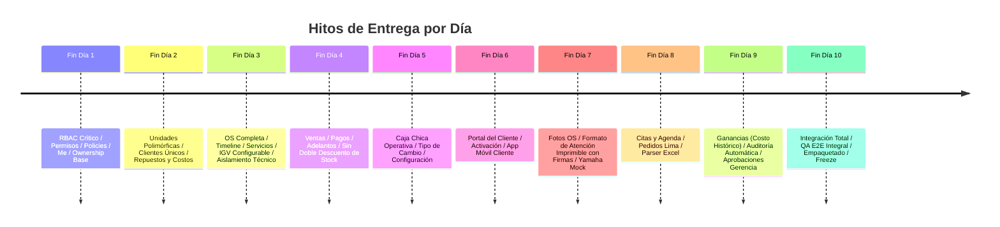
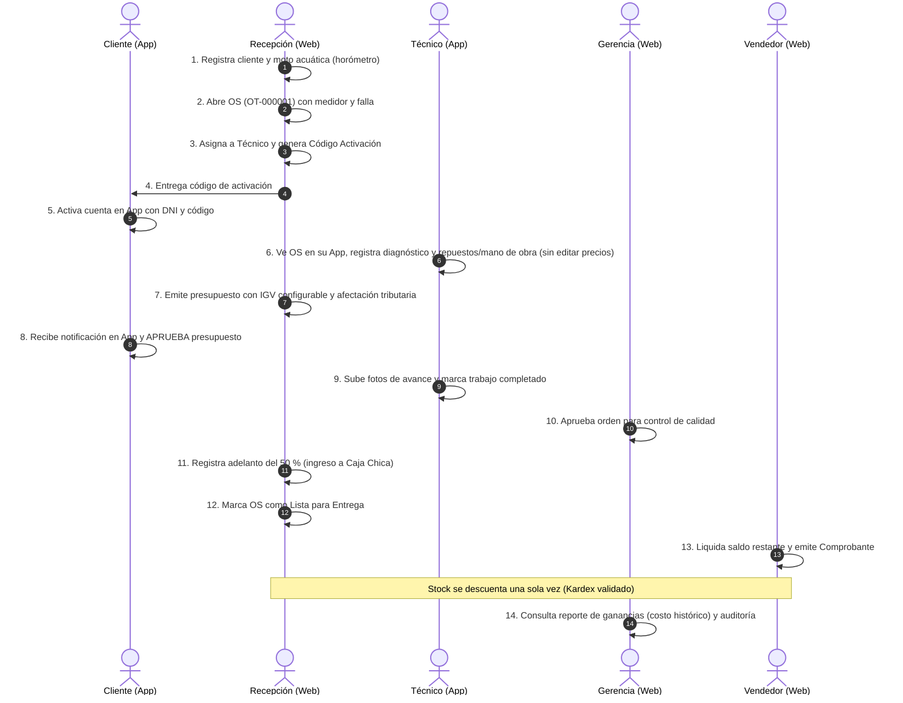

# Plan de Implementación Acelerado (10 Días Laborables)
## Plataforma Team Benavides — Taller Post-Venta y Tienda de Repuestos

---

## Decisiones de Negocio Pendientes

Para asegurar un desarrollo sin fricciones y evitar asumir reglas de negocio no confirmadas, se clasifica el estado de las definiciones clave del proyecto en tres categorías:

### 1. Confirmado (Reglas cerradas y operativas)
* **Alcance y Tiempo**: 100 % del alcance acordado en 10 días laborables intensivos, sin recortar módulos ni crear Fase 2.
* **Roles Definitivos**: Exactamente 5 roles: `Gerencia/Admin`, `Recepcion`, `Tecnico`, `Vendedor`, `Cliente`.
* **Reglas de Seguridad y Autorización**:
  * `Gerencia/Admin`: Acceso global, administración de usuarios/roles/permisos y aprobación obligatoria de excepciones de OS.
  * `Tecnico`: Acceso restringido exclusivamente a las OS que tiene asignadas. No modifica precios ni realiza aprobación final ni entrega.
  * `Vendedor`: Gestiona ventas y comprobantes. No modifica precios de catálogo ni aplica descuentos libres.
  * `Cliente`: Aislamiento estricto (solo ve sus propios datos). Consulta sus unidades, OS, timeline, presupuestos y comprobantes; aprueba o rechaza presupuestos.
* **Jerarquía de Propiedad de Datos**: `Usuario (Auth) → Cliente (CRM) → Unidades (Vehículos) → Órdenes de Servicio / Ventas`.
* **Estados de la OS**: Se mantienen estrictamente los 7 estados existentes en el código: `Abierta`, `Diagnostico`, `Aprobada`, `EnProceso`, `Lista`, `Entregada`, `Cancelada`.
* **Reglas Específicas de Transición y Aprobaciones en OS**:
  * No existe una regla genérica donde todas las transiciones dependan de Cliente + Gerencia.
  * Cada transición de estado se gobierna por su propia regla de autorización/aprobación:
    * `Recepcion`: Puede abrir la orden (`Abierta`), asignar técnico y emitir presupuesto.
    * `Tecnico`: Registra diagnóstico (`Diagnostico`), agrega trabajos/repuestos ejecutados y reporta avance, pero no realiza aprobación final ni entrega.
    * `Cliente`: Aprueba o rechaza el presupuesto presentado (`AprobacionPresupuestoCliente`). Su aprobación habilita el inicio de los trabajos en taller.
    * `Gerencia/Admin`: Interviene en aprobaciones excepcionales requeridas por política (descuentos altos, reaperturas o cancelaciones).
    * `Lista` y `Entregada`: Se ejecutan por Recepción o Gerencia una vez concluidos los trabajos y liquidado el servicio.
* **IGV Configurable con Afectación Tributaria por Línea**:
  * No se asume que toda línea lleva IGV automáticamente ni se hardcodea el 18 %.
  * Se contempla un porcentaje configurable (inicial 18 %) y la afectación tributaria por línea/producto/servicio: `Gravado` (aplica tasa vigente), `Exonerado` o `Inafecto`.
  * Se persisten siempre los valores históricos aplicados (`TipoAfectacion`, `SubtotalGravado`, `PorcentajeIgvAplicado`, `MontoIgv`, `Total`).
* **Ganancia Base**: `Ganancia = Precio de Venta (sin IGV) - Costo Histórico Guardado`.
* **Caja Chica Inicial**: Registro de ingresos y egresos de caja chica operativa a cargo de la encargada (sin hardcodear identificadores en código), con saldo calculable y reporte por fecha.
* **Rama de Trabajo**: Todo el equipo trabaja sobre `develop`.

### 2. Pendiente de Confirmación (Respuestas que debe dar el cliente)
1. **Caja**:
   * ¿Existe una sola caja chica o se requiere más de una caja (ej. mostrador repuestos vs taller)?
   * ¿Otras personas además de la encargada realizan cobros o pagos con caja?
   * ¿Se requiere apertura y cierre formal diario de caja con monto inicial fijo?
   * ¿Se requiere proceso formal de arqueo ciego o conciliación al final del día?
   * ¿Quiénes tienen permiso para registrar egresos/gastos menores?
   * ¿Quién puede corregir o anular un movimiento de caja erróneo?
   * ¿Cómo se vincula la caja chica con los cobros de ventas de mostrador, adelantos de OS y pagos de servicios?
2. **Ganancias y Utilidad**:
   * ¿Los servicios manuales y la mano de obra entran al cálculo de rentabilidad con un costo asignado o su costo interno es cero (margen 100 %)?
   * ¿Los servicios de terceros (ej. tornería, pintura externa) cómo se costean para el margen neto?
   * ¿El costo del repuesto en inventario se actualiza por costo promedio ponderado o por último costo de compra?
3. **Formato de Atención de Taller**:
   * ¿Cuáles de los campos del formato físico se requieren estructurados para reportería (ej. nivel de combustible, inventario de accesorios) y cuáles quedan como texto de observaciones?
   * ¿La firma de conformidad del cliente en la entrega es física (en documento impreso) o se requiere captura digital en pantalla táctil?
4. **Criterios Específicos de Aprobación de Gerencia**:
   * ¿Qué umbral o condición específica gatilla la aprobación de Gerencia en una OS (ej. presupuestos mayores a S/ 1,500, descuentos extraordinarios, reaperturas o cancelaciones)?
5. **Pedidos Especiales de Lima**:
   * ¿Qué catálogo de estados requiere el taller para el seguimiento de pedidos a Lima?
   * ¿Se exige adelanto mínimo obligatorio al cliente antes de solicitar el repuesto a fábrica?
6. **Estructura del Excel del Cliente**:
   * Formato definitivo de las columnas del inventario y clientes que maneja actualmente Team Benavides.
7. **Integraciones Externas**:
   * Credenciales y manuales de la API oficial de Yamaha.
   * Proveedor y cuenta de WhatsApp Business para el chatbot.

### 3. Supuestos Técnicos Temporales (Para no detener el desarrollo)
1. **Modelo de Caja Extensible**: Se implementa la entidad `Caja` (con instancia inicial "Caja Chica") y `MovimientoCaja` con clave foránea a `CajaId` y `UsuarioResponsableId`. Si más adelante se definen múltiples cajas o turnos, la base de datos ya lo soporta sin migraciones destructivas.
2. **Costo de Servicios en Ganancias**: Inicialmente, los servicios propios y mano de obra se registran con costo 0 (margen bruto = total de venta del servicio), mientras que los repuestos y servicios de terceros registran su costo histórico unitario. La consulta de ganancias permite desglosar "Ganancia Repuestos" y "Ganancia Servicios".
3. **Matriz de Transición de Estados en OS**: Cada estado valida autorizaciones específicas:
   * `Abierta` → `Diagnostico`: Recepción o Técnico asignado.
   * `Diagnostico` → `Aprobada`: Requiere `AprobacionPresupuestoCliente == Aprobado` (y `AprobacionGerencia == Aprobado` solo si aplica por monto o excepción).
   * `Aprobada` → `EnProceso`: Técnico asignado o Recepción para iniciar trabajos.
   * `EnProceso` → `Lista`: Técnico asignado marca finalización técnica o Recepción tras control de calidad.
   * `Lista` → `Entregada`: Recepción o Gerencia tras liquidación de pago.
   * `Cancelada`: Requiere rol `Gerencia/Admin` o `Recepcion` con motivo obligatorio.
4. **Plantilla de Excel Estandarizada**: El importador se implementa contra una plantilla definida por el equipo de desarrollo con validación estricta de encabezados. Si el Excel del cliente difiere, se mapeará a esta plantilla validada.
5. **Entorno Móvil Flutter**: Tras verificar que en la máquina local se encuentra instalado Flutter 3.35.4 (Dart 3.9.2) mientras que `develop` tiene fijado `sdk: ^3.13.3`, se conserva intacto el constraint del repositorio sin alterar `pubspec.yaml` por decisión explícita. El desarrollo de vistas en Flutter se realiza con modelos y Riverpod respetando el estándar del proyecto.

---

## 1. Objetivo

Completar el **100 % del alcance aprobado** de la plataforma Team Benavides en un período intensivo de **10 días laborables (2 semanas)**, sin recortar funcionalidades ni diferir módulos a una Fase 2.

La estrategia reorganiza técnicamente el trabajo mediante:
- Contratos de API/DTO unificados desde el inicio de cada bloque.
- Desarrollo simultáneo y desacoplado entre Backend (Paolo) y Frontend Web/Móvil (Santiago).
- Agrupación técnica de migraciones de Entity Framework Core en **4 bloques estructurales seguros** en lugar de decenas de migraciones dispersas.
- Enfoque incremental de QA diario y pruebas de integración continua sobre la rama única de trabajo `develop`.
- Contención de dependencias externas (Yamaha, SUNAT, WhatsApp, cuentas de tiendas) mediante adaptadores y mocks configurables para no frenar la entrega del producto operativo.
- Distribución de tareas de integración (Excel, Yamaha Mock) a lo largo de los Días 7 y 8 para reservar el Día 10 a integración final, pruebas E2E, corrección de bloqueantes, empaquetado y congelamiento.

---

## 2. Estrategia de Paralelización



### Reglas de Paralelización Técnica:
1. **RBAC como Camino Crítico**: El backend establece la matriz de seguridad y policies en el Día 1. Frontend Web y Móvil avanzan en paralelo utilizando contratos DTO y mocks locales, pero no bloquean el cierre del backend.
2. **Ownership y Jerarquía desde el Inicio**: La relación `Usuario → Cliente → Unidades → OS` se define desde el Día 1 en contratos y Día 2 en BD, asegurando que la seguridad del Portal del Cliente esté embebida en la arquitectura base.
3. **Migraciones Agrupadas Seguras**: 4 bloques coherentes que reducen el riesgo de refactorizaciones y conflictos de migración.
4. **Validación Autorizativa en Servidor**: Las políticas de seguridad residen en el backend (`IAuthorizationService` y custom handlers). La UI refleja permisos ocultando u habilitando acciones, pero la seguridad crítica nunca descansa en el cliente.
5. **Aislamiento de Dependencias de Terceros**: Yamaha tras `IYamahaApiClient` con fallback Mock; WhatsApp tras `IMessagingService`; SUNAT mediante persistencia de campos fiscales estructurados sin requerir emisión electrónica directa.

---

## 3. Cronograma Día por Día

---

### DÍA 1 · Lunes
#### RBAC Crítico, 5 Roles Definitivos, Catálogo de Permisos, Policies y Contratos Base

* **Objetivo del día**: Resolver la columna vertebral de la plataforma: seguridad real basada en políticas en el backend, matriz de 5 roles, catálogo de permisos y modelo de ownership `User → Cliente`.

| Área | Responsable | Tareas Técnicas Detalladas |
|---|---|---|
| **Backend (Camino Crítico)** | Paolo | 1. **5 Roles Definitivos** en `RolSeeder`: `Gerencia/Admin`, `Recepcion`, `Tecnico`, `Vendedor`, `Cliente`.<br>2. **Catálogo de Permisos** cerrado (`modulo.accion`): permisos para órdenes, diagnósticos, repuestos, precios, caja, reportes, usuarios y configuración.<br>3. **Policies en ASP.NET Core**: Configurar requerimientos de autorización (`PermissionAuthorizationHandler`) en `Program.cs`.<br>4. **Reglas de Autorización en Servidor**:<br>   - `Tecnico`: Solo consulta sus OS asignadas (`TecnicoAsignadoId == usuarioId`); rechazo a modificaciones de precios o aprobación final.<br>   - `Vendedor`: Acceso a ventas; rechazo a modificación de precios unitarios o descuentos libres.<br>   - `Cliente`: Restricción estricta de datos (solo accede a registros donde `ClienteId == usuario.ClienteId`).<br>   - `Gerencia/Admin`: Acceso a administración de roles, reportes de rentabilidad y aprobaciones extraordinarias.<br>5. **Endpoint `/api/auth/me`**: Retornar `id`, `email`, `nombreCompleto`, `roles`, lista de `permisos` y `clienteId` vinculado.<br>6. **Gestión de Credenciales**: Endpoints de cambio y reseteo administrativo de contraseñas. |
| **Frontend** | Santiago | 1. **Web**: Actualizar `sesion.tsx` y `jwt.ts` para parsear y almacenar roles y permisos de `/api/auth/me`.<br>2. **Web**: Implementar componente `<PermisoGuard>` para renderizado condicional de botones y rutas.<br>3. **Web**: Adaptar menú lateral en `AppLayout.tsx` filtrando destinos según los permisos del usuario.<br>4. **Flutter**: En `sesion.dart`, adaptar lectura de perfil y roles para preparar navegación condicional (Técnico vs Administrativo vs Cliente) mediante DTO acordado. |
| **Dependencias** | Contrato DTO | 08:30 AM: Definir y congelar el catálogo de códigos de permisos y el JSON de respuesta de `/api/auth/me`. |
| **Entregable** | Verificable | API autentica y aplica `403 Forbidden` a nivel de endpoint ante acciones no autorizadas. `/api/auth/me` entrega claims y permisos. Web y App ocultan/desactivan opciones no permitidas. |
| **QA Mínimo** | Incremental | Iniciar sesión con 5 usuarios de prueba (1 por rol). Verificar rechazo de acceso: Técnico a precios/usuarios (403), Vendedor a descuentos (403), usuario no autenticado a recursos privados (401). |

---

### DÍA 2 · Martes
#### Migración Bloque 1: Modelo Polimórfico de Unidades, Clientes Únicos e Inventario con Costos

* **Objetivo del día**: Desacoplar unidades de la obligatoriedad de la placa (soportar motos acuáticas y generadores con horómetro), formalizar la relación `User → Cliente` y dotar a repuestos de control de costos y umbrales configurables.

| Área | Responsable | Tareas Técnicas Detalladas |
|---|---|---|
| **Backend** | Paolo | 1. **Migración EF Bloque 1**: `AmpliarBaseCore`: <br>   - `Clientes`: agregar `TipoDocumento` (DNI, RUC, etc.), `NumeroDocumento` con índice único filtrado por `Activo == true`. Agregar `UsuarioId` nullable con índice único filtrado por `Activo == true AND UsuarioId IS NOT NULL` para formalizar la relación `User → Cliente`.<br>   - `Vehiculos`: agregar `TipoUnidad` (Motocicleta, MotoAcuatica, Generador, Otro), `NumeroSerieVIN`, `NumeroMotor`, `TipoMedidor` (Km u Horas), `LecturaMedidorActual`. Hacer `Placa` nullable con índice único filtrado por `Activo == true AND Placa IS NOT NULL`.<br>   - `Productos`: agregar `Costo` (`numeric(12,2)`), `StockMinimo` nullable (si es null, aplica el de categoría o 4 por defecto).<br>   - `CategoriasProducto`: agregar `StockMinimoDefault`.<br>   - `MovimientosInventario`: agregar `CostoUnitario` en entradas.<br>2. Actualizar DTOs, mappers y servicios de Clientes, Vehículos e Inventario.<br>3. Endpoints para ajuste de stock con bloqueo `FOR UPDATE` protegido por permiso `inventario.ajustar`. |
| **Frontend** | Santiago | 1. **Web**: En `ModalVehiculo.tsx` y `UnidadesPage.tsx`: selector de tipo de unidad, campos VIN/Serie, Motor, selector Km vs Horas y placa opcional.<br>2. **Web**: En `ModalCliente.tsx`: tipo y número de documento con validación (8 dígitos DNI, 11 RUC).<br>3. **Web**: En `RepuestosPage.tsx` y `ModalProducto.tsx`: campo Costo y umbral de stock configurable.<br>4. **Flutter**: Adaptar modelos y pantallas de `unidades.dart` y `clientes.dart` con soporte de unidades sin placa y horómetro. |
| **Dependencias** | Backend bloqueante | Paolo entrega endpoints actualizados a las 13:00. Santiago conecta formularios por la tarde. |
| **Entregable** | Verificable | Registro exitoso de una moto acuática (con serie y horas) y un generador sin placa. Repuestos guardan costo y alertan stock bajo según umbral configurable (4 por defecto). Relación `User → Cliente` lista en BD. |
| **QA Mínimo** | Incremental | Registrar cliente con DNI y con RUC; registrar una unidad de cada tipo (moto con km, moto acuática con horas, generador sin placa); registrar repuesto con costo y validar alerta de stock bajo. |

---

### DÍA 3 · Miércoles
#### Órdenes de Servicio Core: Historial de Estados, Asignación de Técnico, Servicios e IGV Configurable con Afectación Tributaria

* **Objetivo del día**: Flujo central del taller robusto: líneas de OS tipadas (repuesto, servicio, mano de obra), cálculo de IGV usando configuración vigente y tipo de afectación por línea, asignación estricta de técnico y timeline auditable de estados gobernado por reglas de autorización.

| Área | Responsable | Tareas Técnicas Detalladas |
|---|---|---|
| **Backend** | Paolo | 1. **Entidades y Migración**: <br>   - Tabla `HistorialEstadosOrden` (OrdenId, EstadoAnterior, EstadoNuevo, UsuarioId, Fecha, Observacion).<br>   - `OrdenesServicio`: `NumeroCorrelativo` (secuencia BD ej. `OT-000001`), `FechaEstimadaEntrega`, `LecturaMedidorIngreso`, `FechaSalida`.<br>   - Campos de aprobación y control: `EstadoPresupuestoCliente` (Pendiente, Aprobado, Rechazado) y `EstadoAprobacionGerencia` (NoAplica, Pendiente, Aprobado, Rechazado).<br>2. **Catálogo de Servicios**: Entidad y endpoints `/api/servicios` (Nombre, PrecioSugerido, TipoAfectacionIgv [Gravado, Exonerado, Inafecto], Activo).<br>3. **Detalles Tipados en OS**: `DetalleServicio`: `TipoItem` (Repuesto, Servicio, ManoDeObra, Terceros), `ServicioId` opcional, `CostoUnitarioHistorico`, `TipoAfectacionIgv`, `SubtotalGravado`, `PorcentajeIgvAplicado`, `MontoIgv`, `Total`. Persistir importes calculados en la fila para preservar el histórico tributario.<br>4. **Cálculo de IGV por Línea**: Leer tasa vigente de configuración (inicial 18 %); si `TipoAfectacionIgv == Gravado`, calcular `MontoIgv = SubtotalGravado * PorcentajeIgv`; si es `Exonerado` o `Inafecto`, `MontoIgv = 0`. Guardar valores en base de datos.<br>5. **Reglas de Seguridad y Transición**: Cada transición de estado se rige por su regla: Recepción abre, Técnico registra diagnóstico y reporte de avance, Técnico no altera precios ni autoriza el paso a `Aprobada` o `Entregada`. |
| **Frontend** | Santiago | 1. **Web**: Rediseñar `OrdenDetallePage.tsx`: timeline visual de estados con fechas y responsables; selector de tipo de ítem en `ModalRepuestoOrden.tsx` (repuesto de catálogo, servicio de catálogo, mano de obra manual sin código obligatorio o terceros) con selector de afectación tributaria.<br>2. **Web**: Mostrar desglose financiero en OS: Op. Gravada, Op. Exonerada/Inafecta, IGV vigente y Total.<br>3. **Flutter**: En `orden_detalle.dart` y `ordenes.dart`, adaptar vista para perfil Técnico: listado de órdenes asignadas, registro de diagnóstico, agregar repuestos/servicios visualizando el precio pero sin permitir su edición. |
| **Dependencias** | Contrato DTO | DTO de desglose de ítems (subtotal gravado, afectación, IGV, total) y timeline de estados acordado a las 08:30 AM. |
| **Entregable** | Verificable | OS completa con correlativo `OT-XXXXXX`, desglose exacto de repuestos + servicios + mano de obra, cálculo de IGV con afectación por línea, historial auditable y restricción estricta de precios para perfil Técnico. |
| **QA Mínimo** | Incremental | Crear una OS con una línea gravada y una exonerada; validar que solo la gravada genera IGV y que los totales persisten correctamente. Verificar que el Técnico solo accede a sus OS y no puede cambiar precios. |

---

### DÍA 4 · Jueves
#### Ventas, Pagos, Adelantos, Comprobantes y Eliminación del Doble Descuento de Stock

* **Objetivo del día**: Resolver la integración crítica entre Orden de Servicio, Venta de mostrador, Pagos, Adelantos y Comprobantes, eliminando el riesgo de duplicidad en salidas de almacén.

| Área | Responsable | Tareas Técnicas Detalladas |
|---|---|---|
| **Backend** | Paolo | 1. **Migración Bloque 2**: `VentasPagosComprobantes`: <br>   - Tablas `MetodosPago` (Efectivo, Tarjeta, Yape/Plin, Transferencia) y `Pagos` (Monto, MetodoPagoId, Fecha, UsuarioId, VentaId opcional, OrdenServicioId opcional, EsAdelanto).<br>   - `DetalleVenta`: agregar `TipoItem`, `ServicioId`, `DetalleServicioOrigenId` (trazabilidad con OS), `CostoUnitarioHistorico`, `TipoAfectacionIgv`.<br>   - `Comprobantes`: campos fiscales estructurados: `Serie`, `Numero`, `SubtotalGravado`, `PorcentajeIgv`, `MontoIgv`, `MontoTotal`, `MetodoPagoPrincipal`, `Observaciones`, `OrdenServicioId` opcional.<br>2. **Corrección de Doble Descuento**: Modificar `VentaService`: cuando una venta liquida una OS, los repuestos ya descontados en `OrdenServicioService.AgregarDetalleAsync` NO vuelven a descontarse ni generan segundo movimiento de salida en el Kardex.<br>3. **Reglas de Vendedor**: Validación estricta en servidor de que el vendedor no altere precios unitarios de catálogo ni aplique descuentos.<br>4. Soporte de pagos parciales (adelantos) y cálculo de saldo pendiente en OS y Ventas. |
| **Frontend** | Santiago | 1. **Web**: En `OrdenDetallePage.tsx`: botón de "Registrar Adelanto" y "Liquidar y Generar Comprobante".<br>2. **Web**: En `VentasPage.tsx` y `ModalVenta.tsx`: selector de método de pago, desglose de IGV, registro de adelantos y visualización de saldo pendiente.<br>3. **Web**: Ficha de comprobante administrativo con serie, número correlativo, desglose tributario e impresión.<br>4. **Flutter**: En `tienda.dart` y `ventas.dart`, reflejar el estado de pago, adelantos y saldos en la consulta móvil. |
| **Dependencias** | Lógica transaccional | Paolo diseña la regla de idempotencia de stock en el cierre de OS. Santiago implementa los modales de cobro. |
| **Entregable** | Verificable | Flujo cerrado: OS terminada -> cobro con adelanto previo -> generación de comprobante -> venta confirmada sin doble descuento de stock en Kardex. Vendedor impedido de cambiar precios. |
| **QA Mínimo** | Incremental | Repuesto con stock 10. Agregarlo a OS (stock pasa a 9). Entregar OS y generar venta/comprobante: verificar en BD que el stock se mantiene en 9 y no baja a 8. Registrar adelanto del 50 % y comprobar saldo restante en la interfaz. |

---

### DÍA 5 · Viernes
#### Módulo Caja Chica Operativa, Tipo de Cambio Diario y Configuración Central

* **Objetivo del día**: Dotar a la encargada del control de la caja chica operativa (registro de ingresos y egresos justificados, saldo en tiempo real) y configurar parámetros generales (datos empresa, IGV configurable, tipo de cambio diario manual).

| Área | Responsable | Tareas Técnicas Detalladas |
|---|---|---|
| **Backend** | Paolo | 1. **Modelo de Caja Chica Extensible**: <br>   - Tabla `Cajas` (Id, Nombre = "Caja Chica", UsuarioResponsableId nullable, Activo, FechaCreacion).<br>   - Tabla `MovimientosCaja` (Id, CajaId, TipoMovimiento [Ingreso, Egreso], Concepto, Monto, MetodoPagoId, ReferenciaVentaId nullable, ReferenciaPagoId nullable, MotivoGasto nullable, UsuarioId, FechaCreacion).<br>   - Permisos granulares: `caja.consultar`, `caja.registrar_ingreso`, `caja.registrar_egreso`.<br>2. **Configuración y Tipo de Cambio**:<br>   - Tabla `ConfiguracionEmpresa` (RUC, RazonSocial, Direccion, Telefono, PorcentajeIgv = 0.18, SerieBoletaDefault, SerieFacturaDefault).<br>   - Tabla `TiposCambio` (Fecha [Date], Compra, Venta, UsuarioRegistroId, FechaCreacion).<br>3. **Lógica de Caja**: Saldo calculable en tiempo real (`Sum(Ingresos) - Sum(Egresos)`). Registro de egresos exige `MotivoGasto` obligatorio. Reporte de movimientos por rango de fechas.<br>4. Endpoints CRUD para configuración del negocio y registro diario de tipo de cambio PEN/USD. |
| **Frontend** | Santiago | 1. **Web**: Nueva vista `CajaPage.tsx`: saldo actual de caja chica, tabla de movimientos por fecha con responsable, formulario modal para registrar ingreso manual y egreso/gasto justificado.<br>2. **Web**: Nueva vista `ConfiguracionPage.tsx`: edición de datos fiscales, parámetro de IGV y panel de registro diario de Tipo de Cambio.<br>3. **Web**: Header superior muestra tipo de cambio del día y acceso a caja chica para usuarios autorizados.<br>4. **Flutter**: En tablero móvil administrativo, mostrar indicador del saldo actual de la caja chica. |
| **Dependencias** | Finanzas | Paolo entrega endpoints de caja y configuración a las 14:00. Santiago integra interfaz de caja y ajustes. |
| **Entregable** | Verificable | Registro y consulta de movimientos de caja chica con cálculo exacto de saldo en tiempo real. Configuración de empresa, IGV editable y tipo de cambio diario persistidos. |
| **QA Mínimo** | Incremental | Registrar egreso de S/ 25 por "Movilidad taller" con motivo. Registrar ingreso de S/ 100. Verificar que el saldo refleja exactamente la diferencia. Validar que un usuario sin permiso `caja.registrar_egreso` reciba `403 Forbidden`. |

---

### Hito Fin de Semana 1 (Día 5 · 18:00)
> [!IMPORTANT]
> **Estado al finalizar la Semana 1**:
> - Seguridad robusta con policies reales y matriz de 5 roles.
> - Relación `User → Cliente` implementada en backend y base de datos.
> - Clientes y Unidades polimórficas (motos, motos acuáticas, generadores) operativas.
> - Órdenes de Servicio con cálculo de IGV configurable y afectación tributaria, desglose de ítems, historial de estados y aislamiento para técnicos.
> - Ventas y Comprobantes ligados sin doble descuento de stock.
> - Caja chica operativa funcionando con saldo calculable y registro de egresos justificados.
> - Configuración general y tipo de cambio diario en funcionamiento.

---

### DÍA 6 · Lunes
#### Migración Bloque 3: Portal del Cliente (Web + App Móvil), Activación Segura y Aprobaciones Específicas

* **Objetivo del día**: Poner en marcha el Portal del Cliente consumiendo el modelo `User → Cliente` ya establecido: activación con DNI + código, consulta de unidades, seguimiento de OS y aprobación/rechazo de presupuesto desde la app móvil según [app-cliente.html](file:///d:/Projects/CRMTeamBenavides/docs/referencias/app-cliente.html).

| Área | Responsable | Tareas Técnicas Detalladas |
|---|---|---|
| **Backend** | Paolo | 1. **Migración EF Bloque 3**: `PortalCliente`: <br>   - Tabla `CodigosActivacion` (ClienteId, CodigoHash, FechaExpiracion, Canjeado, IntentosFallidos).<br>   - `OrdenesServicio`: campos de respuesta de cliente (`RespuestaPresupuestoCliente` [Aprobado, Rechazado], `FechaRespuestaCliente`, `ObservacionCliente`).<br>2. **Endpoints de Activación**: `/api/portal/activar` (recibe DNI, código entregado por asesor y contraseña nueva; vincula o crea el `Usuario` con rol `Cliente` y asocia a `Cliente.UsuarioId`). Código vence a las 48h y se bloquea tras 5 intentos fallidos.<br>3. **Endpoints Aislados para Cliente**: `/api/portal/mis-unidades`, `/api/portal/mis-ordenes`, `/api/portal/ordenes/{id}`, `/api/portal/ordenes/{id}/presupuesto/responder` (aprobar/rechazar), `/api/portal/mis-comprobantes`. Filtrado estricto por `ClienteId` del token.<br>4. **Regla de Negocio de Aprobación de Presupuesto**: La aprobación del cliente autoriza el inicio de los trabajos en taller. Si la orden tiene observaciones o descuentos mayores a los autorizados, requerirá adicionalmente la aprobación de Gerencia para avanzar. |
| **Frontend** | Santiago | 1. **Flutter (App del Cliente según `app-cliente.html`)**:<br>   - Pantalla 1: Activación de cuenta (`DNI` + `Código de asesor` + contraseña).<br>   - Pantalla 2: Vista de "Mis Unidades" y tarjeta de "Orden en curso".<br>   - Pantalla 3: Timeline visual de avance de orden (Recibida -> Diagnóstico -> Presupuesto Aprobado -> En reparación -> Lista -> Entregada).<br>   - Pantalla 4: Vista de Presupuesto detallado con botones "Aprobar" y "Rechazar".<br>   - Pantalla 5: Pestaña "Documentos" con listado de comprobantes asociados.<br>2. **Web**: En `ClienteDetallePage.tsx`, botón administrativo para "Generar código de activación de app" para entregar al cliente. |
| **Dependencias** | Seguridad de datos | Paolo garantiza que las queries del portal aplican filtro `ClienteId == usuario.ClienteId`. Santiago implementa las vistas móviles de cliente según el diseño aprobado. |
| **Entregable** | Verificable | Flujo completo de cliente: Asesor genera código en web -> Cliente activa cuenta en Flutter con su DNI -> Cliente ve sus unidades y su OS en curso -> Cliente aprueba o rechaza el presupuesto desde la app. |
| **QA Mínimo** | Incremental | Crear orden en estado `Diagnostico` con presupuesto cargado. Entrar como cliente desde la app, aprobar presupuesto. Verificar que la orden en el backend actualiza `RespuestaPresupuestoCliente = Aprobado`. Intentar consultar un `id` ajeno con el token de cliente y comprobar `403/404`. |

---

### DÍA 7 · Martes
#### Fotos de OS, Formato de Atención Imprimible con Firmas e Inicio de Yamaha Mock

* **Objetivo del día**: Cumplir con la inspección física fotográfica de OS, generar la Orden de Trabajo oficial imprimible con formato de taller autorizado y avanzar la infraestructura del adaptador Yamaha Mock en paralelo.

| Área | Responsable | Tareas Técnicas Detalladas |
|---|---|---|
| **Backend** | Paolo | 1. **Entidades y Almacenamiento**: Tabla `FotosOrdenServicio` (OrdenServicioId, TipoEtapa [Ingreso, Diagnostico, Salida], RutaArchivo, MiniaturaRuta, TamanioBytes, ContentType, UsuarioId, FechaSubida).<br>2. Servicio `IFileStorageService` con implementación local (`LocalStorageService`) preparado para migrar a S3/Blob sin cambiar controladores.<br>3. Endpoints multipart: `POST /api/ordenes-servicio/{id}/fotos` y `GET /api/ordenes-servicio/{id}/fotos`. Límite de 10 MB y tipos `image/jpeg`, `image/png`, `image/webp`.<br>4. Formato de atención en `OrdenServicio`: campos de inspección visual, nivel de combustible y observaciones de ingreso.<br>5. **Paralelo Integraciones**: Implementar `YamahaMockApiClient` para simular catálogo de despieces y garantías sin depender de credenciales externas. |
| **Frontend** | Santiago | 1. **Flutter**: En `orden_detalle.dart` (perfil Técnico/Recepción): botón para capturar fotos con cámara/galería y subirlas etiquetadas por etapa.<br>2. **Web**: En `OrdenDetallePage.tsx`: galería de fotos con visualizador modal.<br>3. **Web**: Generador de vista de impresión / PDF de la Orden de Servicio según el formato oficial de atención del cliente (datos de unidad, cliente, diagnóstico, repuestos, servicios, casillas para firma física de cliente y del taller). |
| **Dependencias** | Almacenamiento de archivos | Paolo define la ruta de storage configurable (`appsettings.json`) y endpoints de upload. Santiago conecta el picker de fotos en Flutter. |
| **Entregable** | Verificable | Subida y visualización de fotos asociadas a la OS desde móvil y web. Vista previa e impresión del formato de atención de OS listo para firma. Adaptador Yamaha Mock operativo en backend. |
| **QA Mínimo** | Incremental | Subir 3 fotos desde la app a una orden; verificar persistencia en disco y visualización en galería web. Abrir el formato imprimible y verificar que los datos coinciden con la orden y calculan los totales correctamente. |

---

### DÍA 8 · Miércoles
#### Migración Bloque 4: Citas / Agenda, Pedidos de Lima y Preparación de Plantilla Excel

* **Objetivo del día**: Programación de citas para mantenimiento, gestión de pedidos de repuestos a Yamaha Lima con seguimiento de entrega, y diseño del parser con plantilla estandarizada de importación Excel.

| Área | Responsable | Tareas Técnicas Detalladas |
|---|---|---|
| **Backend** | Paolo | 1. **Migración EF Bloque 4**: `CitasPedidosLimaYAuditoria`: <br>   - Tablas `Citas` (ClienteId, VehiculoId opcional, Fecha, HoraInicio, HoraFin, Motivo, EstadoCita [Pendiente, Confirmada, Atendida, Cancelada], TecnicoAsignadoId opcional, Canal [Web, App, Mostrador]).<br>   - Tabla `BloqueosHorario` (Fecha, HoraInicio, HoraFin, Motivo).<br>   - Tabla `PedidosLima` (NumeroPedido, Proveedor, FechaSolicitud, FechaEstimadaLlegada, FechaRecepcion, EstadoPedido [Solicitado, EnTransito, Recibido, Cancelado], Observaciones, OrdenServicioId opcional).<br>   - Tabla `DetallesPedidoLima` (ProductoId, Cantidad, CostoUnitario).<br>2. Endpoints para Citas (solicitud desde cliente/recepción, confirmación, agenda por día) y Pedidos de Lima (registro y cambio de estado a recibido).<br>3. **Paralelo Excel**: Desarrollar servicio `ImportadorExcelService` basado en la plantilla documentada en la Sección 7, con validación celda por celda y reporte estructurado de errores por fila. |
| **Frontend** | Santiago | 1. **Web**: Nueva vista `CitasPage.tsx` con calendario interactivo de citas, asignación a técnicos y confirmación de turnos.<br>2. **Web**: Pestaña en Repuestos para `PedidosLimaPage.tsx`: registro de pedido a Lima, tracking de estado y botón "Marcar como Recibido" (ingreso a inventario).<br>3. **Flutter**: En el portal del cliente, opción "Agendar Cita" seleccionando fecha, unidad y motivo. |
| **Dependencias** | Módulos nuevos | Contratos DTO de citas y pedidos de Lima cerrados a primera hora. |
| **Entregable** | Verificable | Citas agendadas y visibles en calendario de taller. Pedidos de repuestos a Lima registrados y actualizables. Parser de importación Excel preparado con plantilla modelo. |
| **QA Mínimo** | Incremental | Registrar una cita para el día siguiente; verificar que se visualiza en la agenda web y no permite solapamientos no autorizados. Crear pedido a Lima, cambiar a 'Recibido' y verificar recepción. |

---

### DÍA 9 · Jueves
#### Reportes de Ganancias (Costo Histórico), Auditoría Automática y Aprobaciones de Gerencia

* **Objetivo del día**: Dotar a la Gerencia de visibilidad sobre rentabilidad real (Ganancia = Venta - Costo Histórico), registrar trazabilidad completa de acciones sensibles mediante interceptor automático en EF Core y habilitar la aprobación formal de Gerencia en OS.

| Área | Responsable | Tareas Técnicas Detalladas |
|---|---|---|
| **Backend** | Paolo | 1. **Interceptor de Auditoría EF Core**: `AuditoriaSaveChangesInterceptor`:<br>   - Llena automáticamente `CreadoPorId`, `ModificadoPorId`, `FechaCreacion`, `FechaModificacion`.<br>   - Registra en `EventosAuditoria` cambios sensibles: cambios de estado de OS, anulaciones de ventas, modificaciones de stock/precios, y aprobaciones de Gerencia con payload JSON anterior/nuevo.<br>2. **Aprobación Formal de Gerencia**: Endpoint `/api/ordenes-servicio/{id}/aprobar-gerencia` protegido con policy `SoloGerencia` para autorizaciones especiales (descuentos, excepciones o cancelación).<br>3. **Módulo de Ganancias**: Servicio `ReporteRentabilidadService`:<br>   - `Ganancia = Precio de Venta (sin IGV) - Costo Histórico Guardado`.<br>   - Desglose por repuestos (con costo histórico) y servicios/mano de obra.<br>   - Análisis de rentabilidad por producto, venta y período.<br>4. Endpoints de consulta de auditoría y reporte consolidado para Gerencia. |
| **Frontend** | Santiago | 1. **Web**: En `ReportesPage.tsx`: pestaña "Rentabilidad y Ganancias" con selector de fechas, ganancia total, margen porcentual y ranking de repuestos más rentables (gráficos SVG).<br>2. **Web**: En `OrdenDetallePage.tsx`: control de "Aprobación de Gerencia" visible únicamente para rol `Gerencia/Admin`.<br>3. **Web**: Vista de "Auditoría del Sistema" (`AuditoriaPage.tsx` o modal) para consultar bitácora de eventos relevantes.<br>4. **Flutter**: En `tablero.dart`, asegurar que métricas financieras solo se muestren a roles con permisos gerenciales. |
| **Dependencias** | Reportería y Auditoría | Paolo entrega queries de rentabilidad y activa el interceptor. Santiago implementa las tablas y métricas en reportes. |
| **Entregable** | Verificable | Reporte de rentabilidad exacto por rango de fechas basado en costo histórico. Auditoría registrando automáticamente modificaciones de entidades en la base de datos sin llamadas manuales. Control de aprobación de Gerencia operativo. |
| **QA Mínimo** | Incremental | Realizar venta de repuesto (costo histórico S/ 50, venta S/ 80). Validar que el reporte indica ganancia de S/ 30. Modificar un stock manualmente y verificar que `EventosAuditoria` registró usuario, fecha y valores anterior/nuevo. |

---

### DÍA 10 · Viernes
#### Integración Total, Suite E2E de los 5 Roles, Regresión, Empaquetado y Congelamiento

* **Objetivo del día**: Jornada dedicada exclusivamente a integración final, resolución de bloqueantes, pruebas E2E integrales por rol, empaquetado de artefactos y congelamiento (`freeze`) del código funcional.

| Área | Responsable | Tareas Técnicas Detalladas |
|---|---|---|
| **Backend** | Paolo | 1. **Prueba del Importador Excel**: Probar carga masiva de clientes, vehículos y repuestos con la plantilla modelo; verificar reporte de errores ante filas inválidas.<br>2. **Verificación de Integración**: Revisión de logs, ejecución de scripts SQL idempotentes y verificación de healthchecks `/health`.<br>3. **Acompañamiento E2E**: Monitoreo de transacciones, validaciones de concurrencia (`FOR UPDATE`) y consistencia de datos en base de datos. |
| **Frontend** | Santiago | 1. **Web**: Componente de subida de Excel con visualizador de errores por fila.<br>2. **Web y Móvil**: Limpieza final de componentes huérfanos, formateo unificado de monedas (`S/ 0.00`) y fechas (formato local Perú).<br>3. **Móvil**: Empaquetar y verificar APK debug/release para los dispositivos del taller.<br>4. **Acompañamiento E2E**: Ejecución de las pruebas de punta a punta en Web y Móvil cubriendo los 5 roles. |
| **Ambos** | Paolo & Santiago | **Ejecución de la Suite E2E Integral** (ver Sección 5) y **Congelamiento de `develop`** para la etapa posterior de UAT y capacitación. |
| **Entregable** | Verificable | Sistema 100 % integrado, probado de punta a punta con los 5 roles, con APK generado y rama `develop` congelada para UAT. |
| **QA Mínimo** | **E2E Integral** | Ejecución completa del ciclo de taller y tienda cubriendo los 5 roles en paralelo sin errores. |

---

## 4. Hitos Verificables



* **Fin Día 1**: Seguridad implementada; matriz de 5 roles funcionando; `/api/auth/me` con claims y permisos; menús condicionados; ownership base establecido.
* **Fin Día 2**: Unidades de cualquier tipo (incluye motos acuáticas y generadores con horómetro) registradas y consultadas en web y app; repuestos con costo y umbral de 4 unidades por defecto; relación `User → Cliente` en base de datos.
* **Fin Día 3**: Órdenes de servicio con desglose de repuestos + servicios + mano de obra, cálculo de IGV configurable y afectación tributaria, correlativo `OT-XXXXXX` y restricción efectiva para Técnicos.
* **Fin Día 4**: Circuito de cobros, adelantos y liquidación de OS a venta sin doble descuento de stock en el kardex; vendedor restringido de alterar precios.
* **Fin Día 5**: Caja chica operativa con registro de ingresos y egresos justificados con motivo; saldo calculable en tiempo real; configuración del taller y tipo de cambio diario registrados.
* **Fin Día 6**: Portal del cliente operativo; activación mediante DNI y código; seguimiento de orden y aprobación de presupuestos desde Flutter.
* **Fin Día 7**: Inspección fotográfica de OS subida desde móvil y visualizada en web; formato oficial de atención imprimible con firmas físicas; conector Yamaha Mock operativo.
* **Fin Día 8**: Citas agendadas y gestionadas en calendario de taller; pedidos de repuestos a Lima con control de llegada; plantilla y parser de Excel listos.
* **Fin Día 9**: Reporte de ganancias netas basado en costo histórico por repuesto y período; auditoría global automática operando; Gerencia aprueba excepciones.
* **Fin Día 10**: Suite E2E superada al 100 % con los 5 roles; importador de Excel probado; APK generado y rama congelada para UAT.

---

## 5. Estrategia de QA y Prueba E2E Integral

### QA Incremental Diario (Cierre 17:30 a 18:00)
Cada día a las 17:30 se ejecuta una sesión de 30 minutos de verificación conjunta:
- Paolo verifica que los endpoints respondan con latencia menor a 250 ms, con validaciones de entrada (`ProblemDetails`) y códigos HTTP correctos (`200`, `201`, `400`, `403`, `404`).
- Santiago valida que la UI capture errores de autorización (`403 Forbidden`) mostrando notificaciones claras sin caídas de la app.
- Ejecución obligatoria de suites automáticas: `dotnet build`, `vitest run` y pruebas unitarias correspondientes.

### Prueba E2E Integral (Día 10)
Cubre el ciclo completo del taller y tienda involucrando a los 5 roles:



---

## 6. Estrategia de Migraciones de Base de Datos

Se consolidan **4 bloques de migración técnica en Entity Framework Core**:

```
src/CRMTeamBenavides.Api/Migrations/
├── 20260915002909_InicialModeloDatos.cs (Existente)
├── 20260915005234_AgregarIdentityAUsuarios.cs (Existente)
├── 20260915011908_AgregarRefreshTokens.cs (Existente)
├── 20260918040154_AgregarModuloChatbotInicial.cs (Existente)
│
├── [DÍA 2] 20260930_Bloque1_CoreSeguridadUnidadesRepuestos.cs
├── [DÍA 4] 20261002_Bloque2_VentasPagosComprobantesCaja.cs
├── [DÍA 6] 20261004_Bloque3_PortalClienteYFotos.cs
└── [DÍA 8] 20261006_Bloque4_CitasPedidosLimaYAuditoria.cs
```

### Reglas Técnicas de Migración:
1. **Índices Únicos Filtrados por `Activo`**: Todos los índices únicos (`Placa`, `VIN`, `DocumentoIdentidad`, `Codigo`, `UsuarioId`) se aplican con cláusula WHERE `"Activo" = true`, permitiendo reutilizar identificadores si un registro previo fue dado de baja lógica.
2. **Precisión Numérica Estricta**: Todo campo monetario utiliza `numeric(12,2)` y tipos de cambio `numeric(10,4)`. Cero tipos flotantes (`double`/`float`).
3. **Valores por Defecto Seguros**: Toda nueva columna requerida incluye valor por defecto para no romper registros existentes.
4. **Idempotencia**: Las migraciones se ejecutan mediante script SQL idempotente (`dotnet ef migrations script --idempotent`).

---

## 7. Especificación de la Plantilla de Importación Excel

El importador transaccional del backend espera un archivo Excel (`.xlsx` o `.csv`) con hojas estructuradas y columnas exactas:

### Hoja 1: `Clientes`
| Columna | Tipo | Obligatorio | Validación / Ejemplo |
|---|---|---|---|
| `TipoDocumento` | Texto | Sí | `DNI`, `RUC`, `CE` |
| `NumeroDocumento` | Texto | Sí | 8 dígitos para DNI, 11 para RUC. Único. |
| `NombreCompleto` | Texto | Sí | Nombres y apellidos o Razón Social |
| `Telefono` | Texto | No | Formato celular Perú (9 dígitos) |
| `Email` | Texto | No | Formato email válido |
| `Direccion` | Texto | No | Dirección fiscal o particular |

### Hoja 2: `Unidades`
| Columna | Tipo | Obligatorio | Validación / Ejemplo |
|---|---|---|---|
| `DocumentoPropietario` | Texto | Sí | Debe coincidir con un cliente existente |
| `TipoUnidad` | Texto | Sí | `Motocicleta`, `MotoAcuatica`, `Generador`, `Otro` |
| `Placa` | Texto | No | Requerido si es Motocicleta; opcional para otros |
| `NumeroSerieVIN` | Texto | Sí para sin placa | VIN o número de serie de chasis |
| `NumeroMotor` | Texto | No | Número de motor de fábrica |
| `Marca` | Texto | Sí | Ej. `Yamaha` |
| `Modelo` | Texto | Sí | Ej. `YZF-R3`, `WaveRunner VX`, `EF2200iS` |
| `Anio` | Entero | No | Año de fabricación (ej. 2023) |
| `TipoMedidor` | Texto | Sí | `Kilometros` u `Horas` |
| `LecturaMedidor` | Entero | Sí | Lectura actual (>= 0) |

### Hoja 3: `Repuestos`
| Columna | Tipo | Obligatorio | Validación / Ejemplo |
|---|---|---|---|
| `Codigo` | Texto | Sí | Código de parte / SKU único |
| `Nombre` | Texto | Sí | Descripción del repuesto |
| `Categoria` | Texto | Sí | Nombre de categoría (se crea si no existe) |
| `UnidadMedida` | Texto | Sí | `unidad`, `litro`, `juego`, etc. |
| `Costo` | Decimal | Sí | Costo de compra sin IGV (`numeric(12,2)`) |
| `PrecioVenta` | Decimal | Sí | Precio de venta sugerido (`numeric(12,2)`) |
| `StockActual` | Entero | Sí | Stock físico inicial (>= 0) |
| `StockMinimo` | Entero | No | Umbral de alerta (si está vacío, aplica 4) |

**Regla de Ejecución**: Si una sola fila presenta errores de validación, la importación se cancela en su totalidad (transacción atómica) y se retorna un reporte detallado con número de fila, columna y mensaje de error.

---

## 8. Gestión de Riesgos

| Riesgo Técnico / Operativo | Probabilidad | Impacto | Plan de Mitigación Inmediato |
|---|---|---|---|
| **Ausencia o retraso de un desarrollador** | Media | Alto | Cierres diarios de código en `develop`. Nada queda en ramas locales. Ambos conocen la arquitectura base para dar soporte mutuo. |
| **Modelos de datos discordantes entre Back y Front** | Baja | Alto | Contratos DTO congelados a primera hora. Validación de tipos mediante TypeScript estricto y serializadores tipados en Dart. |
| **Inconsistencias en cálculo de IGV y redondeos** | Media | Medio | Toda operación matemática de cálculo de IGV y totales se realiza y redondea a 2 decimales en el Backend (`decimal.Round(..., 2, MidpointRounding.AwayFromZero)`). El frontend solo muestra los valores calculados por la API. |
| **Discrepancia de SDK en Flutter** | Media | Medio | Se conserva el constraint acordado en `develop`. El desarrollo de vistas se desacopla mediante modelos y Riverpod sin modificar el archivo de configuración hasta coordinación con el equipo. |

---

## 9. Dependencias Externas (Fuera de Control Inmediato)

Para garantizar que el desarrollo se complete en los 10 días sin interrupciones, las dependencias de terceros se aíslan formalmente:

| Dependencia Externa | Estado Real | Estrategia de Aislamiento Técnico |
|---|---|---|
| **API Yamaha (Credenciales / Docs)** | En gestión por el cliente | Se utiliza la interfaz `IYamahaApiClient` con implementación `YamahaMockApiClient` configurada en `appsettings.json` (`Modo: "Mock"`). El sistema opera con catálogo simulado sin detener ninguna función. |
| **WhatsApp Business API** | Sin proveedor / cuenta | El Chatbot y soporte ya operan mediante el widget Web y la pantalla de chat en Flutter. La integración de WhatsApp se conectará al webhook existente sin afectar el CRM. |
| **SUNAT / OSE / PSE** | Fuera de alcance de emisión en vivo | Los comprobantes se registran administrativamente con todos los datos tributarios requeridos (serie, correlativo, IGV configurable, método de pago, cliente). Están listos para enchufar un proveedor electrónico sin cambiar la BD. |
| **Hosting de Producción** | Sin contratar | El desarrollo y QA diario se ejecutan en local y red interna. El despliegue se realiza al finalizar los 10 días sobre cualquier VPS Linux con Docker o Windows Server. |
| **Datos Reales de Excel del Cliente** | Pendiente entrega | El importador transaccional se construye y prueba con la plantilla estandarizada documentada en la Sección 7. Cuando el cliente entregue sus archivos, se pasan por el importador validado. |
| **Cuentas de Google Play / Apple Store** | Tiempos de aprobación largos | La app se distribuye directamente mediante archivo APK / instalador para los dispositivos del taller y clientes piloto. No se requiere aprobación de tiendas para el Go Live. |

---

## 10. Conclusión y Próximos Pasos

Con este plan acelerado de 10 días laborables, el equipo mantiene el 100 % del alcance acordado, respeta las decisiones pendientes sin inventar reglas arbitrarias y asegura un sistema robusto, probado y listo para la fase de UAT y capacitación.
